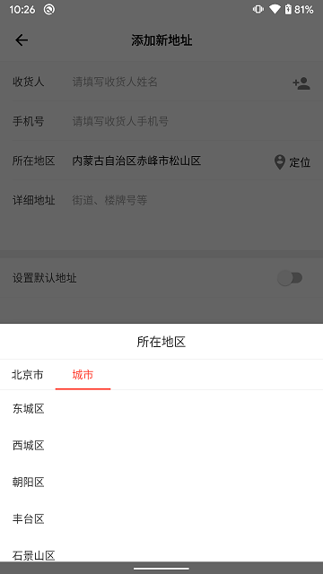

# AddressPicker
AndroidX版省市区地址选择,代码为kotlin版

## Demo



## Getting started
In your build.gradle:

```
allprojects {
     repositories {
	  ...
	  maven { url 'https://jitpack.io' }
     }
}

dependencies {
   implementation 'com.github.zhourenjun:AddressPicker:1.0.0'
}
```
## UseCase
```
  val regionPicker = RegionPicker(this)
  regionPicker.setOnAddressPickSuccessListener { region ->
     tv.text = "${region.province}${region.city}${region.district}"
  }
  regionPicker.show()
```

